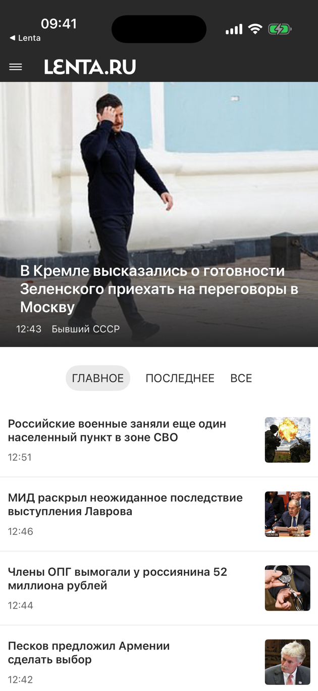
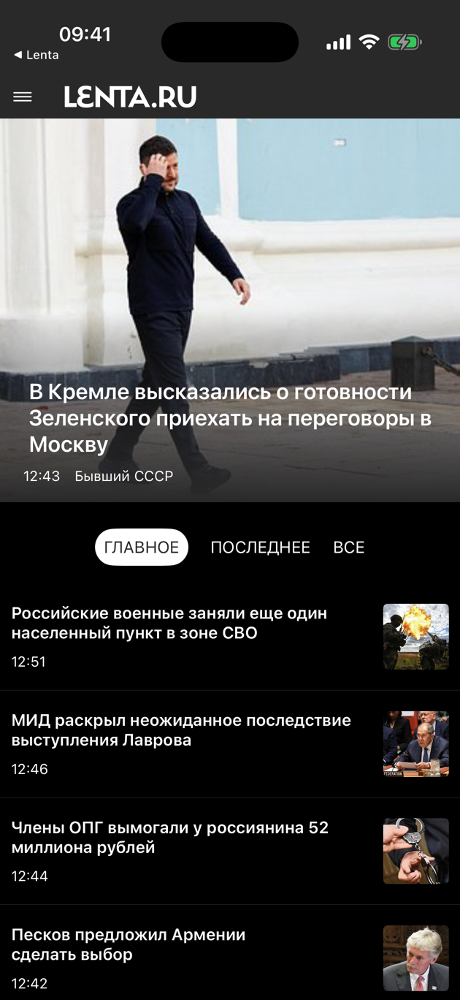

# NewsRSSReader (iOS)

Нативное iOS-приложение для чтения новостей на Swift и SwiftUI, отображающее новости из
RSS-лент Lenta.ru. Приложение повторяет дизайн и поведение сайта с минимумом возможностей:
только чтение новостей через официальный RSS-канал. В комплекте — отдельное приложение для
Apple Watch.

На устройстве приложение называется **Lenta**. Это неофициальное приложение: оно не связано с
редакцией Lenta.ru и не имеет к ней отношения — оно лишь читает её открытые RSS-ленты.

Версия для Android — [NewsRSSReaderAndroid](https://github.com/simakov/NewsRSSReaderAndroid).

## Как это выглядит

 

## Возможности

- Просмотр новостей по вкладкам: **Главное** / **Последнее** / **Все**
- Главная новость ленты крупно, с фотографией
- Меню с категориями новостей
- Детальный просмотр статьи с блоками контента: абзацы, подзаголовки, изображения с подписями,
  цитаты, инфобоксы, подписи авторов
- «Поделиться» статьёй: заголовок и ссылка уходят в системное меню отправки
- Нажатие на логотип в шапке прокручивает ленту к началу
- Скелетон с анимацией мерцания, пока лента и статья загружаются
- Поддержка iPhone и iPad, светлой и тёмной темы

### Apple Watch

Отдельное приложение для watchOS (`NewsRSSReaderWatch`) работает самостоятельно, без iPhone:
сам загружает ленты и статьи. На часах доступны те же три ленты, список категорий и чтение
статьи с теми же блоками контента, что и на телефоне.

Сейчас приложение для часов собирается отдельной схемой и **не встроено** в iOS-сборку — IPA в
релизах содержит только приложение для iPhone/iPad. Цель расширения с виджетом для циферблата
(`NewsRSSReaderWatchExtension`) в проекте есть, но пока ни в одно приложение не встроена.

## Технологии

- **Swift** + **SwiftUI**
- Архитектура **MVVM**: `ObservableObject`-ViewModel с `@Published`-свойствами
- **URLSession** для сетевых запросов
- **SDWebImageSwiftUI** для асинхронной загрузки и кеширования изображений
- **XcodeGen** для генерации Xcode-проекта из `project.yml`

Минимум внешних зависимостей: SDWebImageSwiftUI (вместе с SDWebImage) — единственная сторонняя
библиотека. Парсинг RSS реализован на `XMLParser` из Foundation, а HTML статей — собственным
мини-токенайзером (`SimpleHTMLParser`), без сторонних библиотек парсинга (без FeedKit и
SwiftSoup). Эффект мерцания на скелетонах тоже свой, без SwiftUI-Shimmer.

## Архитектура

Код, общий для iPhone и часов — модели, сервисы, парсеры, ViewModel и отрисовка блоков статьи, —
вынесен во фреймворк `NewsRSSReaderShared`. Приложения для iOS и watchOS содержат только свои
экраны.

Цели проекта (`project.yml`):

- `NewsRSSReader` — приложение для iPhone и iPad
- `NewsRSSReaderShared` — общий фреймворк
- `NewsRSSReaderWatch` — приложение для Apple Watch
- `NewsRSSReaderWatchExtension` — расширение с виджетом для циферблата

Структура исходников:

```
NewsRSSReaderShared/
├── Model/                 NewsItem, ArticleContent (ArticleContentType — типы блоков статьи)
├── Services/              LentaFeedService (ленты + карта категорий), LentaRSSParser (RSS 2.0),
│                            ArticleLoaderService (загрузка HTML статьи),
│                            SimpleHTMLParser (токенайзер), LentaArticleParser (тело статьи)
├── ViewModels/            HomeViewModel
├── ViewComponents/Article/ блоки контента статьи (абзац, подзаголовок, изображение, цитата и т.д.)
└── Utilities/             PlatformAsyncImage, PlatformConstants — размеры под iOS и watchOS

NewsRSSReader/             приложение для iOS
├── ContentView.swift        корневой экран: шапка, меню, переключение лента/категория
├── Views/                   Home, NewsTop, NewsTabs, NewsView, CategoryView, ArticleDetailView
└── ViewComponents/          MenuView, Shimmer

NewsRSSReaderWatch/        приложение для watchOS: WatchHomeView, WatchFeedView,
                             WatchCategoryView, WatchArticleDetailView
NewsRSSReaderWatch Extension/  виджет для циферблата (WidgetKit)
```

## Где взять

**GitHub Releases** — готовый IPA в [релизах](https://github.com/simakov/iosrssreader/releases).
Приложения нет в App Store, поэтому IPA устанавливается сторонним установщиком вроде
[AltStore](https://altstore.io) или [Sideloadly](https://sideloadly.io): он переподписывает
приложение вашим Apple ID. С бесплатным Apple ID такая подпись действует 7 дней, после чего
приложение нужно переподписать.

Либо соберите приложение из исходников — см. ниже.

## Требования

- macOS с Xcode 15 или новее
- [XcodeGen](https://github.com/yonaskolb/XcodeGen): `brew install xcodegen`
- iOS 16.4+ / watchOS 9.0+ на устройстве

## Сборка и запуск

Файл `.xcodeproj` в репозитории не хранится — он генерируется из `project.yml`:

```bash
xcodegen generate
open NewsRSSReader.xcodeproj
```

Перегенерируйте проект после каждого изменения `project.yml` и после добавления или удаления
файлов.

Сборка для симулятора из командной строки:

```bash
xcodebuild -project NewsRSSReader.xcodeproj -scheme NewsRSSReader \
  -destination 'generic/platform=iOS Simulator' build
```

Схемы:

- `NewsRSSReader` — приложение для iPhone/iPad
- `NewsRSSReaderWatch` — приложение для Apple Watch; запускайте его на симуляторе часов

### Подпись

Чтобы запустить приложение на своём устройстве, в `project.yml` нужно указать свою команду
разработчика и свой префикс идентификатора приложения — текущие привязаны к аккаунту автора:

- `DEVELOPMENT_TEAM` в `settings.base` — ID вашей команды (Xcode → Settings → Accounts)
- `bundleIdPrefix` и все `PRODUCT_BUNDLE_IDENTIFIER` / `WKCompanionAppBundleIdentifier`

Идентификатор App Group (`group.net.idscan.lentareader.newsrssreader`) задан в трёх файлах
`.entitlements` и в `LentaFeedService.swift` — при смене префикса поменяйте его везде одинаково.
Для симулятора подпись не нужна.

### Релизная сборка

Для экспорта нужен файл `build/ExportOptions.plist` (подставьте ID своей команды):

```xml
<?xml version="1.0" encoding="UTF-8"?>
<!DOCTYPE plist PUBLIC "-//Apple//DTD PLIST 1.0//EN" "http://www.apple.com/DTDs/PropertyList-1.0.dtd">
<plist version="1.0">
<dict>
	<key>method</key>
	<string>release-testing</string>
	<key>teamID</key>
	<string>YOUR_TEAM_ID</string>
	<key>signingStyle</key>
	<string>automatic</string>
</dict>
</plist>
```

Архив и экспорт IPA:

```bash
xcodebuild -project NewsRSSReader.xcodeproj -scheme NewsRSSReader -configuration Release \
  -archivePath build/NewsRSSReader.xcarchive -allowProvisioningUpdates archive
xcodebuild -exportArchive -archivePath build/NewsRSSReader.xcarchive \
  -exportPath build/export -exportOptionsPlist build/ExportOptions.plist -allowProvisioningUpdates
```

Если `xcodebuild` не видит учётную запись (`No Account for Team`), соберите архив из Xcode
(Product → Archive) и экспортируйте его второй командой.

## Тестирование

Автотестов в проекте пока нет: приложение проверяется вручную на симуляторе и устройстве.

## Работа с лентами и категориями

- URL лент: `https://lenta.ru/rss/{top7|last24|news}[/{category}]`
- Первая новость ленты показывается крупно (`NewsTop`), остальные — списком
- Список категорий (`LentaFeedService.categories`) должен соответствовать актуальному списку,
  который отдаёт Lenta.ru
- `NewsItem.publishedDate()`: пустая строка, если `published` равно nil; `"HH:mm"`, если дата
  совпадает с текущим днём; иначе `"d.MM HH:mm"`

## Лицензия

[GNU General Public License v3.0](LICENSE) или, по вашему выбору, любая более поздняя версия.

Copyright (C) 2023 Andrey Simakov

Это свободная программа: вы можете распространять и изменять её на условиях GPLv3. Она
распространяется в надежде, что будет полезной, но **без каких-либо гарантий** — даже без
неявной гарантии товарной пригодности или пригодности для определённой цели. Полный текст
лицензии — в файле [LICENSE](LICENSE).

Приложение не собирает никакой статистики и не содержит ни аналитических SDK, ни сборщиков
крэшей: единственные сетевые запросы, которые оно делает, — это загрузка лент и статей с
Lenta.ru и загрузка картинок к ним.
